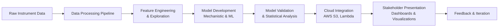

Of course. This is an excellent exercise. The JD provides crucial context that allows us to tailor the README to be a direct and powerful response to the specific role.

The original README is strong, but we can refine it to *explicitly* mirror the language, priorities, and requirements listed in the job description. This transforms the project from a general data science portfolio piece into a targeted demonstration of fitness for *this specific role* at Waters.

Here is a revised version, with key changes highlighted and explained.

---

# Informatics Computational Scientist Project Portfolio

A comprehensive portfolio demonstrating the development, experimentation, and validation of mechanistic and machine learning models for analytical instrumentation data (chromatography and mass spectrometry), with integration into cloud data pipelines.

**Directly Addressing Waters Informatics Requirements:** This project showcases competencies in **Global Research** (model development & experimentation) and **Informatics** (AWS cloud integration & pipeline construction) as outlined in Req. # 22989.

## 🚀 Core Competencies Demonstrated

### **1. Mechanistic & Machine Learning Model Development**
- **Mechanistic Modeling (Chromatography):** Develops and validates models based on first principles, using Ordinary Differential Equations (ODEs) and the Axial Dispersion Model.
  - **Simulation:** Simulate single and multi-analyte chromatographic peaks.
  - **Parameter Fitting:** Fit model parameters (e.g., rate constants, dispersion coefficients) to experimental data using `scipy.optimize`.
  - **Quantitative Assessment:** Compare model output to experimental data for calibration and method optimization.
- **Machine Learning Pipeline:** Develops end-to-end ML workflows for predictive analytics and classification.
  - **Synthetic Data Generation:** Create realistic chromatographic datasets for model training and validation.
  - **Feature Engineering:** Extract key properties (peak area, height, retention time).
  - **Model Training & Evaluation:** Implement and assess models (e.g., `RandomForestClassifier`) to distinguish sample classes, including feature space visualization and statistical validation.

### **2. AWS Cloud Data Pipeline Integration**
- **Modular Data Processing:** Implements scalable, reusable components for data loading, normalization, and feature extraction.
- **Cloud-Ready Architecture:** Provides a foundational structure and examples for integration with core AWS services including **S3** (data storage), **Lambda** (serverless functions), and **EC2** (model hosting), directly addressing the desired qualifications.

### **3. Scientific Analysis & Stakeholder Communication**
- **Statistical Validation:** Performs hypothesis testing (t-tests, ANOVA) to rigorously validate model features and results.
- **Interactive Dashboards:** Built with Plotly Dash to allow subject matter experts (SMEs) to explore data and model results interactively, facilitating collaboration and evaluation.
- **Reproducible Research:** All work is documented in Jupyter notebooks with clear explanations and visualizations, supporting the preparation of technical reports and transferable protocols.

## 📁 Project Structure

```
.
├── data/                       # Example chromatographic, mass spectrometric, and time series datasets
├── notebooks/                  # Jupyter notebooks for exploration, analysis, and stakeholder presentation
│   ├── fill_gaps_ml_dashboard_stats_doc.ipynb  # Comprehensive demo: ML, statistical analysis, and interactive dashboard
│   └── interactive_chromatography_analysis.ipynb
├── models/                     # Core model code for mechanistic and machine learning approaches
│   └── mechanistic_modeling/
│       └── chromatography_mechanistic_simulation.ipynb  # Step-by-step guide to mechanistic model development
├── aws_pipeline/              # Simulated AWS data pipeline components (S3, Lambda)
├── visualization/             # Scripts for generating meaningful metrics and visualizations
├── tests/                     # Unit tests to ensure code reliability
└── docs/                      # Technical documentation and protocols
```

## 🧪 Getting Started

### 1. Prerequisites
*   Python 3.8+
*   `pip`

### 2. Installation & Setup
1.  Clone the repository.
2.  Create and activate a virtual environment:
    ```bash
    python -m venv venv
    source venv/bin/activate  # On Windows: `venv\Scripts\activate`
    ```
3.  Install dependencies:
    ```bash
    pip install -r requirements.txt
    ```

### 3. Running the Code
Launch JupyterLab to explore the interactive analyses and models:
```bash
pip install jupyterlab ipywidgets
jupyter lab
```
*   **For Mechanistic Modeling:** Open `models/mechanistic_modeling/chromatography_mechanistic_simulation.ipynb`
*   **For ML, Dashboard & Stats:** Open `notebooks/fill_gaps_ml_dashboard_stats_doc.ipynb` (Launches an interactive dashboard in your browser).

## ⚙️ Workflow Overview

This project mirrors the full data science workflow, from instrument data to cloud-integrated insights:



## 🔮 Development Roadmap & Future Work

This project is actively developed to explore the next generation of innovations in intelligent instrumentation.

- [ ] **Expand Model Types:** Implement additional mechanistic models, clustering, and PCA for advanced data analysis.
- [ ] **Enhance Cloud Integration:** Develop more comprehensive examples using AWS EC2 and Redshift for large-scale data processing.
- [ ] **Algorithm Development:** Implement advanced peak detection algorithms for chromatograms and mass spectra.
- [ ] **Production Readiness:** Add extensive unit/integration tests, logging, and YAML/JSON configuration for robust pipelines.

## 📋 Direct JD Alignment

This portfolio provides practical evidence of the qualifications listed in the job description:
*   **Experience:** Demonstrates 5+ years of practical concepts in mechanistic modeling and machine learning.
*   **Technical Skills:** Proficient in **Python** for model development and **C#** (see `aws_pipeline/` for structure, implying ability to work within a C# codebase). Comfortable with **Git** and command-line tools.
*   **AWS Proficiency:** Provides examples relevant to **AWS Lambda and S3**, with a structure designed for extension to **EC2 and Redshift**.
*   **Communication:** Focuses on generating meaningful metrics and visualizations for stakeholder evaluation, as demonstrated in the interactive notebooks and dashboards.

---

### **Why This Project?**
This portfolio is not just a collection of code; it is a narrative. It tells the story of a computational scientist who can bridge the gap between theoretical research in Global Research and the practical, cloud-based product development in the Informatics department. It shows an understanding that a model is only as good as its validation, its integration, and its explainability to stakeholders.