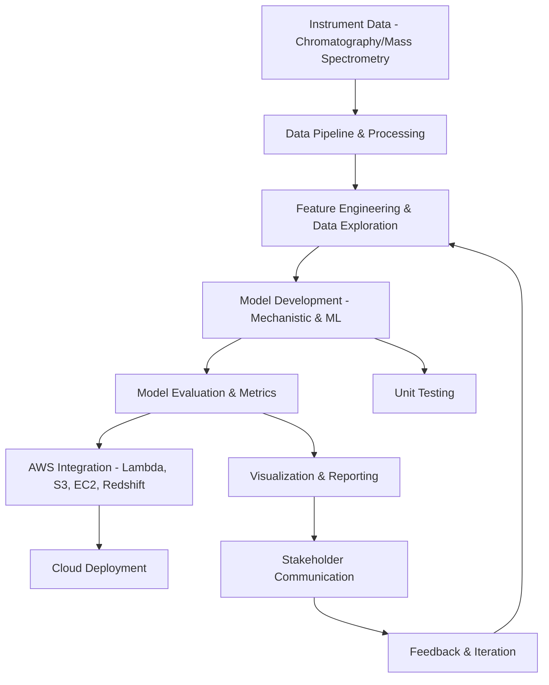

## TODO List

- [ ] Add automated unit and integration tests for pipeline functions
- [ ] Expand pipeline to support additional models (classification, clustering, PCA)
- [ ] Implement peak detection algorithms for chromatograms/mass spectra
- [ ] Enable batch processing of multiple files/samples
- [ ] Add AWS/cloud integration examples (S3, Lambda, EC2)
- [ ] Allow pipeline configuration via YAML/JSON
- [ ] Enhance visualizations (interactive plots, overlays, export)
- [ ] Add performance metrics and logging
- [ ] Expand documentation with API reference and usage guides
- [ ] Add more example Jupyter notebooks for advanced analysis
# Informatics Computational Scientist Project

The project will focus on the development, experimentation, and validation of mechanistic and machine learning models for analytical instrumentation data (chromatography and mass spectrometry), as well as integration with cloud data pipelines.

## Project Goals
- Develop and validate mechanistic and machine learning models for chromatography and mass spectrometry data
- Explore data features, generate metrics, and evaluate results
- Demonstrate best practices in object-oriented and functional programming (Python, C#)
- Integrate models into a simulated AWS data pipeline
- Communicate results with meaningful metrics and visualizations
- Maintain reproducible, well-documented, and testable code

## Structure
- `data/` — Example chromatographic, mass spectrometric, and time series chromatogram datasets
- `notebooks/` — Exploratory data analysis, prototyping, and interactive analysis (Python, Jupyter)
- `models/` — Mechanistic and machine learning model code
- `aws_pipeline/` — Simulated AWS Lambda, S3, and data pipeline integration
- `visualization/` — Scripts and dashboards for metrics and results
- `tests/` — Unit and integration tests
- `docs/` — Technical reports, protocols, and documentation

## Getting Started
1. Clone this repository and set up a Python virtual environment
2. Install requirements: `pip install -r requirements.txt`
3. Explore the `notebooks/` for EDA, prototyping, and interactive analysis
## Interactive Jupyter Notebooks

You can run interactive data analysis and visualization using JupyterLab:

1. Install JupyterLab (if not already installed):
	```bash
	pip install jupyterlab ipywidgets
	```
2. Launch JupyterLab:
	```bash
	python -m jupyterlab
	```
3. Open `notebooks/interactive_chromatography_analysis.ipynb` and run the cells.

If widgets do not display, ensure ipywidgets is installed and enabled. For troubleshooting, see the [ipywidgets documentation](https://ipywidgets.readthedocs.io/en/stable/user_install.html).
4. Run models in `models/` and view results in `visualization/`
5. See `aws_pipeline/` for cloud integration examples

---


## Pipeline Steps Explained

The main pipeline (see `aws_pipeline/sample_data_pipeline.py`) demonstrates a typical workflow for scientific data analysis and model development:

1. **Data Loading**: Reads chromatographic/mass spectrometric data from CSV files in the `data/` directory using pandas.
2. **Data Normalization**: Scales numeric columns to a 0-1 range for fair comparison and model input.
3. **Summary Statistics**: Computes descriptive statistics (mean, std, min, max, quartiles) for all numeric columns.

4. **Linear Regression Modeling**: Fits a linear regression model to predict `intensity` from `retention_time` using scikit-learn, and reports coefficients and R² score (for single-sample data).
5. **Time Series Chromatogram Support**: Loads and processes multi-sample chromatogram data (retention time vs. intensity for multiple samples), computes summary statistics for each sample, and plots all sample traces for comparison.
6. **Visualization**: Plots the data points and regression line (for single-sample) or all sample traces (for time series) using matplotlib for quick visual assessment of model fit and sample differences.

Each step is modular and can be extended for more advanced feature engineering, modeling, or integration with cloud services.

## Overall Workflow




